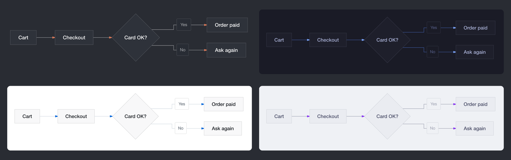

# Mermaid Inline

Mermaid Inline draws the Mermaid diagrams in Claude's replies right inside your terminal. When Claude writes a ` ```mermaid ` code block, you see the diagram in its place, with labels at the size of the text around it, instead of the source. In terminals that can't show pictures, the same diagram is drawn with Unicode box drawing instead. It is a Claude Code [mod](https://code.claude.com/docs/en/plugins/mods/overview): it redraws each reply that holds a diagram and leaves every other reply to Claude Code.


*Ghostty with its default font (JetBrains Mono, 13pt) and the plugin's default settings.*

Diagrams are laid out by [beautiful-mermaid](https://github.com/lukilabs/beautiful-mermaid) and drawn through the kitty graphics protocol, so pictures need a terminal that shows them that way: [Ghostty](https://ghostty.org/), cmux (built on Ghostty) or [kitty](https://sw.kovidgoyal.net/kitty/). Everywhere else, including iTerm2, WezTerm, Terminal.app and anything inside tmux, you get the box drawing.

## Requirements

- Claude Code 2.1.287 or later, in a terminal session
- Node.js 18 or later with npm on your `PATH`: Claude Code uses npm to install the renderer's packages when it installs the plugin, and the plugin runs its renderer with `node`
- For pictures: Ghostty, cmux or kitty, not inside tmux, which does not pass the pictures through
- macOS or Linux

In the Desktop app, VS Code and `claude -p`, the plugin stays out of the way: replies are drawn as usual.

## Install

```bash
claude plugin marketplace add dazebug/mermaid-inline
claude plugin install mermaid-inline@mermaid-inline
```

Start a new session, or run `/reload-plugins` in an open one. `/plugin` then lists `mermaid-inline` among the active mods, and `/mermaid-inline` shows whether it draws pictures in this terminal, and the font, colors and design it uses.

## Diagrams it draws

Flowcharts (`graph` and `flowchart`, in any direction), `sequenceDiagram`, `stateDiagram-v2`, `classDiagram`, `erDiagram` and `xychart-beta` (bar and line charts). A block of another kind, such as `gantt`, `pie` or `mindmap`, or one that doesn't parse, stays a code block, as Claude wrote it.

A diagram is drawn when its code block is closed and stands at the top level of the reply or in a list item. One in a list item is drawn at the item's indent, and the rest of the list keeps its own indents. One inside a block quote stays code, and so does one still streaming in, until its closing fence arrives. A diagram wider than the terminal is shrunk to fit, and one taller than the screen is shrunk toward the screen's height, its labels no smaller than 60% of their size.

Math in a label, written between `$` signs as in LaTeX (or `$$`, `\(…\)`, `\[…\]`), is drawn as the Unicode text LaTeX Inline writes math as where it shows no pictures: `$x^2$` as x², `$\alpha \le \beta$` as α ≤ β, `$\frac{a+b}{c}$` as (a + b)/c. A `$` that doesn't open math, as in `$5`, stays as written, and so does a formula whose text would change the diagram, such as `|x|` in an edge label, where the bars would end the label.

The plugin adds a short section to Claude's system prompt, only in sessions where it draws pictures, that says Mermaid blocks are shown as diagrams, which kinds are drawn, and to keep diagrams small with short labels. Set `teach_claude` to `false` to leave the system prompt alone; Claude then draws diagrams only when it writes them on its own or you ask for one.

It works beside [LaTeX Inline](https://github.com/dazebug/latex-inline): in a reply that holds both diagrams and math, each plugin draws its own part, whichever runs first. Use LaTeX Inline 0.3.3 or later with it, so the two leave the same blank rows between their parts.

## Design

The default theme, `auto`, draws a diagram on your terminal's own background in its text color, with Claude's orange for arrow heads, so the picture looks like part of the terminal. Pick one of beautiful-mermaid's themes instead and the diagram is drawn on that theme's background, as a card, and change any single color with `colors`:



*`auto`, `tokyo-night`, `github-light` and `catppuccin-latte`.*

Set options with `/plugin configure mermaid-inline@mermaid-inline` or in the `/config` panel. The values are yours alone: they are kept in your own settings, under `pluginConfigs`.

| Option | Default | What it does |
| :- | :- | :- |
| `mode` | `auto` | `auto` draws pictures in Ghostty, cmux and kitty outside tmux, and box drawing in other terminals. `on` always draws pictures, `text` always draws box drawing, `off` leaves the code blocks as written. |
| `teach_claude` | `true` | Adds the diagram section to the system prompt where the plugin draws pictures. |
| `theme` | `auto` | `auto`, or one of `zinc-light`, `zinc-dark`, `tokyo-night`, `tokyo-night-storm`, `tokyo-night-light`, `catppuccin-mocha`, `catppuccin-latte`, `nord`, `nord-light`, `dracula`, `github-light`, `github-dark`, `solarized-light`, `solarized-dark`, `one-dark`. |
| `colors` | (none) | Colors that win over the theme's, as `key=#rrggbb` pairs separated by spaces: `bg` (background), `fg` (text), `line` (edges), `accent` (arrow heads, highlights, chart series), `muted` (secondary text), `surface` (node fill), `border` (node outline). For example `accent=#7aa2f7 line=#5c6370`. |
| `font` | `auto` | The label font: `auto` is Helvetica Neue on macOS and DejaVu Sans, Noto Sans or Liberation Sans on Linux; or the family name of a font installed on your machine. Hangul and other CJK text falls back to a system font that has it. |
| `text_scale` | `1` | Label size relative to your terminal's text. |
| `node_path` | `node` | The Node.js executable that runs the renderer. |
| `font_metrics` | `auto` | `auto` measures your terminal font at session start (below). `manual` always uses the next two options. |
| `cell_aspect` | `2.125` | Your terminal cell's height divided by its width, in pixels. |
| `line_height` | `1.308` | The cell height in ems of your terminal font. |

`/mermaid-inline` names an option value it could not use, such as a theme it doesn't know or a malformed color.

## Matching your terminal

The terminal stretches each picture to fill the cells it is given, so the plugin has to know the shape of a cell to keep diagrams undistorted, and how tall the cell is in ems of the font to draw labels at the size of your text. With `font_metrics` set to `auto`, the default, it works these out at the start of each session the way [LaTeX Inline](https://github.com/dazebug/latex-inline#matching-your-terminal-font) does: it finds the font your terminal is set to (the first `font-family` in Ghostty's config, with Ghostty's built-in JetBrains Mono when none is set, or `font_family` in `kitty.conf`), reads its metrics from the font file and sizes a cell the way the terminal does. Set `font_metrics` to `manual` and enter `cell_aspect` and `line_height` yourself when the measured cell is off, as it is when you zoom the font or adjust the cell in your terminal's config.

The `auto` theme takes your terminal's background and text colors from its config too: Ghostty's `background` and `foreground`, or those of its `theme` (a `light:…,dark:…` pair follows macOS's dark mode), with Ghostty's defaults when neither is set; kitty's `background` and `foreground`, following `include` lines such as the one `kitten themes` writes. When it can't tell, it uses colors that fit Claude Code's dark or light theme. If the background is off, the boxes behind edge labels show as patches of the wrong color: set `bg` in `colors` to your terminal's background.

## Box drawing

Where pictures can't be shown, each diagram is drawn with Unicode box drawing, by beautiful-mermaid's text renderer:

```
┌────────────┐    ┌────────────┐    ┌──────────┐
│ Storefront │    │ Orders API │    │ Payments │
└──────┬─────┘    └──────┬─────┘    └─────┬────┘
       │                 │                │
       │  POST /orders   │                │
       │─────────────────▶                │
       │                 │                │
       │                 │  Charge card   │
       │                 │────────────────▶
       │                 │                │
       │                 │    Charged     │
       │                 ◀╌╌╌╌╌╌╌╌╌╌╌╌╌╌╌╌│
       │                 │                │
       │   201 Created   │                │
       ◀╌╌╌╌╌╌╌╌╌╌╌╌╌╌╌╌╌│                │
       │                 │                │
┌──────┴─────┐    ┌──────┴─────┐    ┌─────┴────┐
│ Storefront │    │ Orders API │    │ Payments │
└────────────┘    └────────────┘    └──────────┘
```

A drawing wider than the terminal can't be shrunk, so that diagram stays a code block.

## Privacy

Mermaid Inline collects no data and sends nothing off your machine: it has no server and makes no network requests. Diagrams are drawn by a local `node` process and kept as pictures in your cache folder. Everything it runs, reads and writes is listed below.

## What it runs, reads and writes

- **Runs**: `node bin/render.mjs` from the plugin folder once per batch of new diagrams, with their Mermaid source on its standard input; it lays each diagram out with beautiful-mermaid and, for pictures, rasterizes it to PNG with [resvg](https://github.com/RazrFalcon/resvg). Where it draws pictures in Ghostty, cmux or kitty, `node bin/terminal.mjs` once at session start, which on macOS runs `defaults read -g AppleInterfaceStyle` when your Ghostty theme depends on dark mode. Nothing else is run. Both start through Claude Code's `$.process.run`, as an argument list with no shell, with the `node` that `node_path` names; the terminal check is stopped after 10 seconds and a render after 60. They run as a separate `node` process because Claude Code runs the hooks module itself with no Node.js APIs or WebAssembly and lets it import only its own files, so the npm packages that lay out and draw the diagrams cannot load there.
- **Writes**: the PNG pictures and a small JSON record per diagram in `$XDG_CACHE_HOME/mermaid-inline` (`~/.cache/mermaid-inline` by default). Delete that folder at any time to clear the cache.
- **Reads**: those cache files; your terminal's config (Ghostty's `config` files in `~/.config/ghostty` and, on macOS, `~/Library/Application Support/com.mitchellh.ghostty`, the files they include with `config-file`, and the theme file their `theme` names, from `~/.config/ghostty/themes` or Ghostty's or cmux's own theme folder; or `~/.config/kitty/kitty.conf` and the files it includes); the headers of the font files in your font folders, to find and measure the terminal font; the label fonts it draws with; your environment's `TERM`, `TERM_PROGRAM`, `KITTY_WINDOW_ID`, `TMUX`, `HOME`, `XDG_CACHE_HOME`, `XDG_CONFIG_HOME` and `GHOSTTY_RESOURCES_DIR`; and Claude Code's `theme` setting.
- **Network**: none at run time. beautiful-mermaid writes a web font `@import` into each SVG, which the renderer removes before drawing; resvg is given local font files and fetches nothing. Claude Code downloads the npm packages pinned in `package-lock.json` (`beautiful-mermaid`, `@resvg/resvg-js` and their dependencies) when it installs the plugin.
- **Sends**: nothing leaves your machine. The diagram sources go to the local `node` renderer on its standard input, and the pictures come back as files in the cache folder.
- **Credentials**: none are read.
- **Hooks**: `session.start` works out how this terminal shows diagrams, measures the font and colors for pictures and registers `/mermaid-inline`; `command.run` answers `/mermaid-inline`; `prompt.compose` adds the diagram section described above; `ui.render`, on assistant messages only, redraws a reply that holds a Mermaid block, its diagrams drawn by the plugin and the text around them handed back to Claude Code (and to any other plugin, such as LaTeX Inline), and leaves the stored message as it was.
- **Changes to Claude**: the diagram section in the system prompt described above, only where the plugin draws pictures, and the `/mermaid-inline` command.

## When a diagram can't be drawn

- A diagram of a kind the renderer doesn't draw, or one it can't parse, stays a code block, and the rest of the reply is still drawn. beautiful-mermaid reads node ids written in ASCII letters and digits; a flowchart whose ids are written in another script draws nothing, so it stays code (labels may be in any script).
- If the renderer can't run at all (no `node`, missing packages), every diagram stays a code block, and the plugin tries again in the next session.
- While a new diagram renders, its code block shows for a moment and is then replaced. When the terminal's width changes, the diagram is drawn again for the new width.

## Limitations

- Copying a reply out of the terminal copies the picture placeholders, not the Mermaid source.
- beautiful-mermaid lays diagrams out its own way, which differs from mermaid.js in places, such as the spacing and where edge labels sit, and it may not read the newest syntax.
- Claude's thinking, shown with ctrl+o, keeps its code blocks as written: Claude Code gives mods no way to redraw it.
- Where Claude Code puts a header above each message, as in the ctrl+o transcript view, a reply that holds a diagram can have a blank row too many under the header and none above the text after a diagram: Claude Code leaves those rows out there, and a plugin cannot tell that view from the normal one.

## Troubleshooting

Run `/mermaid-inline` first: it says whether the plugin draws pictures or box drawing in this terminal and, for pictures, which font and colors it found and the design it uses. For more, start Claude Code with `claude --debug` and search the debug log for `mermaid-inline`. A line ending in `not loaded:` says why the mod did not load, and a `ui.render (AssistantMessage) refused` line names a drawing Claude Code rejected.

## Development

Load your clone for one session with `claude --plugin-dir ./mermaid-inline`; Claude Code doesn't install the packages for a plugin loaded in place, so run `npm ci --ignore-scripts` in the clone first. `claude plugin test` runs the parser and hook tests, and `node --test tests/*.test.mjs` the renderer, color and font measuring tests.

## Acknowledgements

- Diagrams are laid out by [beautiful-mermaid](https://github.com/lukilabs/beautiful-mermaid) from Craft, whose text renderer is based on Alexander Grooff's [mermaid-ascii](https://github.com/AlexanderGrooff/mermaid-ascii), with [ELK](https://github.com/kieler/elkjs) for layout, and rasterized by [resvg](https://github.com/RazrFalcon/resvg).
- The terminal cell is measured the way [Ghostty](https://github.com/ghostty-org/ghostty) (MIT) computes it in `src/font/Metrics.zig`, with code shared with [LaTeX Inline](https://github.com/dazebug/latex-inline).
- Math in labels is turned into Unicode text by a copy of [LaTeX Inline](https://github.com/dazebug/latex-inline)'s converter, `hooks/tex.ts`.
- The cache file names come from [cyrb53](https://github.com/bryc/code/blob/master/jshash/experimental/cyrb53.js), bryc's public-domain string hash.

## License

MIT, see [LICENSE](LICENSE). The renderer's packages, installed from npm, keep their own licenses: beautiful-mermaid (MIT), elkjs (EPL-2.0), entities (BSD-2-Clause) and resvg-js (MPL-2.0).
